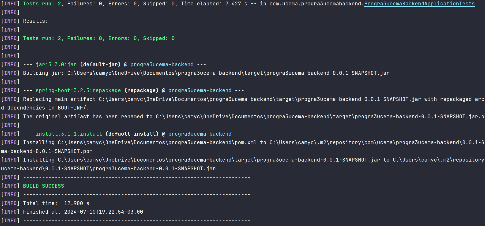
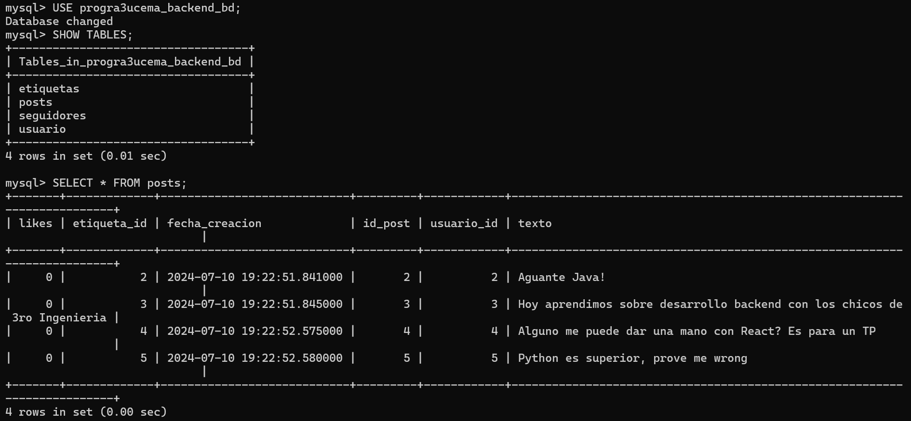
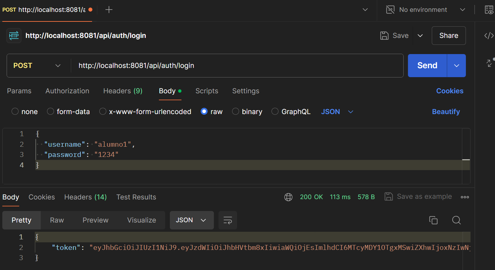
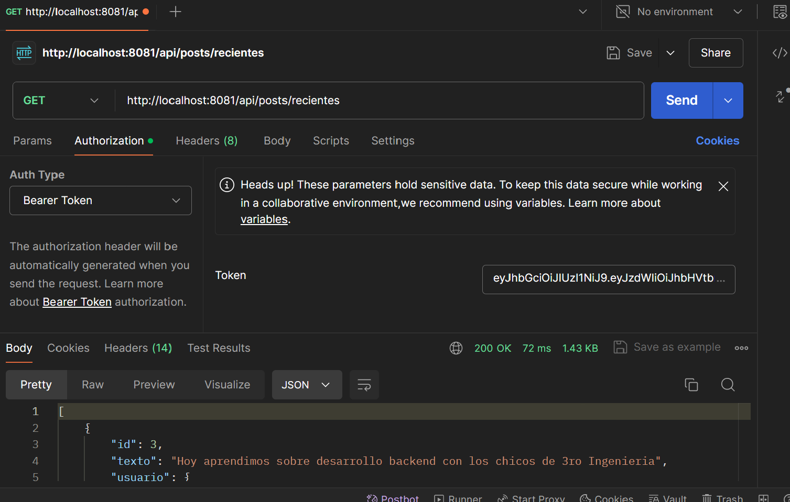

<p align="right"></p>


# **TP de Programación III - Backend**

_Trabajo práctico de Programación III, Ingeniería Infotmática, Universidad del CEMA._

> [Link al repositorio de Github](https://github.com/camicodina/progra3ucema-backend)


## **Objetivos** 📌

El objetivo de este trabajo es crear un desarrollo web completo, que comprende:

1) Un backend funcional, que implemente persistencia y exponga la información por medio de una interfaz API RestFul;

2) Un frontend funcional, que obtenga y muestre correctamente la información proporcionada por el backend.


## **El desarrollo** 🚀

El proyecto es una implementación de un foro donde alumnos y profesores pueden compartir material de ciencia y tecnología (por ejemplo, papers y noticias interesantes) y contenido útil para las cursadas. Los profesores tienen la capacidad de borrar contenido ajeno si lo consideran necesario.

Funcionalidades: 

- Creación de usuarios: profesores (usuarios con permisos de administrador) y alumnos (usuarios comunes);
- Gestión de Posts: Crear, borrar y listar posts asociados a etiquetas.
- Sistema de Etiquetas: Los profesores pueden crear nuevas etiquetas para categorizar los posts.

Diagrama de clases:

<p align="center"></p>


## **Modo de Uso** 📝

Para probar la app, se deben de tener instalados los siguientes componentes:

- [Java JDK 21](https://www.oracle.com/ar/java/technologies/downloads/#jdk21-windows)
- [MySQL Server](https://dev.mysql.com/downloads/mysql/) (version 8.X)
- [Apache Maven](https://maven.apache.org/download.cgi) (version 3.9.8)

Paso 1: Compilar el Proyecto

```bash
    mvn clean install
```

<p align="center"></p>

Paso 2: Ejecutar la Aplicación

```bash
    mvn spring-boot:run
```

Paso 3: Verificar la Ejecución
Si todo está configurado correctamente, el siguiente mensaje aparecerá en la consola:

> Progra3ucemaBackendApplication started

## **Instrucciones** 🦆

Esta aplicación fue creada con un set de datos de prueba iniciales. Podemos validar que los datos de prueba se han creado correctamente de las siguientes formas:

- Verificar en la Base de Datos: Accede a tu base de datos MySQL y verifica que las tablas y los datos de prueba están presentes.

<p align="center"></p>

- Consultar los Endpoints: Usa Postman o ejecuta comandos CURL para realizar solicitudes HTTP a la API.

```shell
# Obtener todos los posts
curl -X GET http://localhost:8081/api/muro/posts

# Obtener el perfil de un usuario
curl -X GET http://localhost:8081/api/muro/perfil/alumno1

# Obtener posts de un usuario específico
curl -X GET http://localhost:8081/api/muro/posts/alumno1
```

## **Tecnologias** ⚙

- Java 21: Lenguaje de programación principal.
- Spring Boot: Framework utilizado para construir el backend.
- MySQL 8: Base de datos utilizada para la persistencia.


## **Detalles Adicionales** 📖

### Método de Login

Authentication: 

- POST /api/auth/login
- POST /api/auth/logout

#### Configurar la solicitud de login (usando Postman)

- Abrir Postman y crear una nueva solicitud.
- Seleccionar el tipo de solicitud como POST.
- Establecer la URL al endpoint de autenticación

```shell
http://localhost:8081/api/auth/login
```

- Ir a la pestaña Body y seleccionar raw.
- Elegir JSON del menú desplegable junto a raw.
- En el cuerpo de la solicitud, proporcionar las credenciales de inicio de sesión en formato JSON:

```shell
{
    "username": "tu_usuario",
    "password": "tu_contraseña"
}
```

Por ejemplo:

```shell
{
    "username": "alumno1",
    "password": "1234"
}
```

- Enviar la solicitud.

Para efectuar el resto de operaciones debemos copiar el token JWT de la respuesta que recibimos.

Demostración:

<p align="center"></p>

<p align="center"></p>


### Otros Endpoints del API

#### Usuario

- Crear Alumno: POST /api/usuario/alumno
- Crear Profesor: POST /api/usuario/profesor

- Actualizar Usuario: PUT /api/usuario/update

- Borrar Usuario: DELETE /api/usuario/delete

- Obtener Usuario por Username: GET /api/usuario/username/{username}
- Obtener Usuario por ID: GET /api/usuario/{id}
- Obtener Información del Usuario: GET /api/usuario/info

- Ver Perfil de Otro Usuario: GET /api/usuario/perfil/{username}
- Seguir a Otro Usuario: POST /api/usuario/{followerId}/follow/{followeeId}

#### Post

- Crear Post: POST /api/posts

- Borrar Post: DELETE /api/posts/{postId}

- Obtener Posts por Usuario: GET /api/posts/user/{username}
- Obtener Posts por Etiqueta: GET /api/posts/etiqueta/{etiquetaId}
- Obtener Posts Recientes: GET /api/posts/recientes

- Dar Like a Post: POST /api/posts/{id}/like
- Quitar Like a Post: POST /api/posts/{id}/unlike

#### Etiqueta

- Crear Etiqueta: POST /api/etiquetas

- Obtener Etiqueta por ID: GET /api/etiquetas/{id}
- Obtener Todas las Etiquetas: GET /api/etiquetas
- Obtener Etiqueta por Nombre: GET /api/etiquetas/nombre/{nombre}

<br>

-----

_Author: Camila Codina_ <br>
_Licence: MIT_

